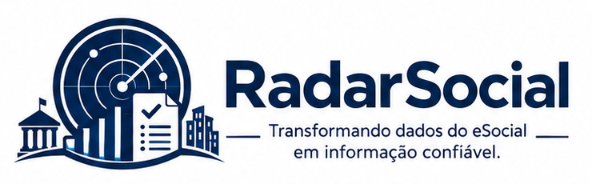

<p align="center">
  
</p>

<h3 align="center">
Análise Inteligente de Eventos, Rejeições e Totalizadores do eSocial
</h3>

<p align="center">
  <a href="LICENSE"></a>
  <a href="https://www.r-project.org/"></a>
  <a href="https://shiny.posit.co/"></a>
  <a href=""></a>
  <a href="https://github.com/KlebersonTJSE/RadarSocial"></a>
</p>

---

## 📖 Sobre o Projeto

O **RadarSocial** é uma aplicação web desenvolvida para apoiar organizações públicas e privadas no monitoramento da qualidade das informações transmitidas ao **eSocial**.

A ferramenta consolida arquivos de eventos do eSocial e oferece uma visão única sobre rejeições, inconsistências e totalizadores oficiais — substituindo a análise manual de retornos técnicos por painéis de fácil leitura.

O acesso é protegido por autenticação corporativa e não depende de uma única empresa: o RadarSocial foi projetado para atender **múltiplas empresas/unidades** a partir da mesma instalação, cada uma com sua própria configuração de diretório corporativo.

> 💡 **Nota:** o RadarSocial oferece recursos dedicados à interpretação dos retornos totalizadores **S-5001, S-5002, S-5003, S-5011, S-5012** e **S-5013**, detalhados mais adiante.

Seu objetivo é transformar informações técnicas e dispersas em conhecimento de fácil compreensão para gestores, equipes de RH, departamentos de pessoal, contabilidade e governança corporativa.

---

## 🎯 Objetivos

- Identificar eventos rejeitados pelo eSocial;
- Detectar inconsistências cadastrais e funcionais;
- Facilitar a análise dos retornos do ambiente nacional;
- Apoiar a correção de erros antes de gerar impactos financeiros;
- Melhorar a qualidade dos dados trabalhistas, previdenciários e tributários;
- Fornecer indicadores de conformidade;
- Apoiar auditorias internas e externas;
- Reduzir retrabalho operacional;
- Garantir rastreabilidade de quem acessa a aplicação e quando.

---

## ✨ Funcionalidades

- 🚨 Monitoramento de eventos **rejeitados**;
- 🔍 Identificação automática de **inconsistências** cadastrais e funcionais;
- 🧾 Análise detalhada dos **retornos totalizadores**;
- 📊 Painéis com indicadores consolidados por evento;
- 🔐 Login corporativo (Active Directory), com suporte a múltiplas empresas;
- 📱 Login alternativo via aplicativo Authenticator (TOTP), sem depender do AD;
- 🏢 Administração de acessos TOTP, com concessão e revogação por login;
- 📈 Auditoria de acessos — tabela e gráficos por usuário, empresa, método e período do dia;
- 📘 Documentação de uso disponível dentro da própria aplicação, a um clique;
- 👤 Painel com os dados do usuário autenticado e método de acesso utilizado.

> ⚠️ **Observação:** a Administração TOTP é restrita a quem acessa via Active Directory, por permitir a concessão de acesso a outras pessoas.

---

## 🔐 Autenticação e Segurança

O RadarSocial foi projetado para operar em ambientes corporativos com múltiplas empresas/unidades, sem exigir instalações separadas para cada uma.

### Login corporativo (Active Directory)

- A pessoa seleciona a **empresa** antes de informar usuário e senha;
- A validação é feita em tempo real contra o diretório LDAP daquela empresa;
- Cada empresa tem sua própria configuração de servidor, porta, domínio e base de busca, isolada das demais.

### Login via Authenticator (TOTP)

- Alternativa para quem não possui usuário no Active Directory;
- Baseado em código de 6 dígitos, renovado a cada 30 segundos;
- Cada login TOTP é cadastrado por um administrador e vinculado a uma empresa específica.

### Auditoria de acessos

- Toda tentativa de login — corporativa ou via Authenticator, bem-sucedida ou não — é registrada;
- O histórico pode ser consultado em forma de tabela ou de gráficos, filtrado por período;
- Indicadores disponíveis: acessos por usuário, por empresa, por método de acesso e por período do dia (manhã, tarde ou noite).

---

## 📊 Totalizadores Monitorados

O **RadarSocial** oferece recursos específicos para análise dos seguintes totalizadores:

| Evento | Descrição                                              |
|--------|---------------------------------------------------------|
| S-5001 | Informações das contribuições sociais por trabalhador   |
| S-5002 | Imposto de Renda Retido na Fonte                        |
| S-5003 | FGTS por trabalhador                                     |
| S-5011 | Consolidação das contribuições sociais                  |
| S-5012 | Imposto de Renda consolidado                            |
| S-5013 | FGTS consolidado                                         |

---

## 📉 Inconsistentes e Rejeitados

O **RadarSocial** facilita a leitura, interpretação e tratamento dos eventos inconsistentes e rejeitados do eSocial, convertendo retornos técnicos em informações gerenciais de fácil entendimento.

Por meio de mecanismos de classificação e consolidação das ocorrências, a ferramenta permite identificar causas, impactos e prioridades de correção — apoiando a tomada de decisão e promovendo maior qualidade e conformidade das informações transmitidas ao ambiente nacional do eSocial.

---

## 👥 Público-Alvo

A solução foi concebida para utilização por:

**Setor Público**

- Tribunais;
- Ministérios;
- Autarquias e fundações;
- Prefeituras;
- Governos estaduais;
- Empresas públicas e sociedades de economia mista.

**Setor Privado**

- Empresas de médio e grande porte;
- Escritórios de contabilidade;
- Consultorias trabalhistas;
- Empresas de terceirização;
- Organizações com grande volume de vínculos.

---

## ✅ Benefícios

- Aumento da conformidade perante o eSocial;
- Melhoria da qualidade dos dados;
- Redução de rejeições;
- Menor risco de passivos trabalhistas e previdenciários;
- Maior segurança na gestão da folha de pagamento;
- Rastreabilidade de acessos, por empresa e por método de login;
- Apoio à tomada de decisão;
- Fortalecimento da governança de dados.

---

## 🛠 Tecnologias Utilizadas

**R / Shiny**

```r
shiny
bslib
DT
jsonlite
digest
DBI
RSQLite
here
reticulate
```

**Opcionais**

```r
rstudioapi   # ajusta o diretório de trabalho ao abrir fora do .Rproj
qrcode       # exibe o QR Code na Administração TOTP
```

**Python** (autenticação Active Directory, via `reticulate`)

```text
ldap3
```

> 💡 **Nota:** o login corporativo depende de um Python acessível ao R (configurável em `RETICULATE_PYTHON`, no `.Renviron`) com o pacote `ldap3` instalado.

---

## 📂 Estrutura do Projeto

```text
RadarSocial/
│
├── app.R
│
├── R/
│   ├── auth.R          # Autenticação Active Directory (LDAP, multi-empresa)
│   ├── auth_totp.R      # Autenticação e administração TOTP, auditoria
│   ├── database.R       # Conexão com bancos de dados por empresa
│   └── utils.R          # Utilitários gerais e resolução de empresas (distros)
│
├── modules/
│   ├── mod_usuario.R          # Dados do usuário autenticado
│   ├── mod_rejeitados.R       # Eventos rejeitados
│   ├── mod_inconsistencias.R  # Inconsistências cadastrais e funcionais
│   ├── mod_totalizadores.R    # Totalizadores S-5001 a S-5013
│   └── mod_totp_admin.R       # Administração de acessos TOTP e auditoria
│
├── data/
│   └── radarsocial.db   # Banco local (usuários TOTP, auditoria de login)
│
├── img/
│   └── radarsocial_logo_fundo_escuro.png
│
├── relatorios/
├── docs/
├── tests/
│
├── .Renviron             # Configuração de empresas, LDAP e Python (não versionado)
├── README.Rmd
├── README.md
├── LICENSE
└── .gitignore
```

---

## 🚀 Instalação

### Clonar o repositório

```bash
git clone https://github.com/SEU-USUARIO/RadarSocial.git
```

### Instalar dependências do R

```r
install.packages(
  c(
    "shiny",
    "bslib",
    "DT",
    "jsonlite",
    "digest",
    "DBI",
    "RSQLite",
    "here",
    "reticulate",
    "rstudioapi",
    "qrcode"
  )
)
```

### Instalar dependência do Python

```bash
pip install ldap3
```

---

## ⚙️ Configuração

Antes da primeira execução, crie um arquivo `.Renviron` na raiz do projeto (não deve ser versionado) com, no mínimo:

```ini
# Python usado pelo login corporativo (AD)
RETICULATE_PYTHON=/caminho/para/python

# Empresas habilitadas (uma linha por empresa, sem pular números)
DISTRO_1=TJSE
DISTRO_2=MPRO

# Configuração LDAP de cada empresa — repita para cada DISTRO_N
TJSE_LDAP_SERVER=ldap://servidor.tjse.exemplo
TJSE_LDAP_PORT=389
TJSE_LDAP_DOMAIN=tjse.exemplo
TJSE_LDAP_SEARCH_BASE=DC=tjse,DC=exemplo

MPRO_LDAP_SERVER=ldap://servidor.mpro.exemplo
MPRO_LDAP_PORT=389
MPRO_LDAP_DOMAIN=mpro.exemplo
MPRO_LDAP_SEARCH_BASE=DC=mpro,DC=exemplo
```

> ⚠️ **Observação:** o app avisa no console, na inicialização, sobre qualquer empresa listada em `DISTRO_N` cuja configuração LDAP esteja incompleta — sem impedir o uso das empresas corretamente configuradas.

---

## ▶️ Execução

```r
shiny::runApp()
```

Ao acessar a aplicação:

1. Escolha o método de entrada — Login Corporativo (AD) ou Authenticator (TOTP);
2. No login corporativo, selecione a empresa antes de informar usuário e senha;
3. Após autenticado, use o ícone <kbd>ℹ️</kbd> na barra superior para consultar este README a qualquer momento, sem sair da aplicação.

---

## 🏛 Governança e Conformidade

O **RadarSocial** foi concebido para fortalecer os processos de controle, auditoria e governança relacionados às obrigações trabalhistas, previdenciárias e tributárias transmitidas ao **eSocial**.

A solução contribui para:

- Integridade dos dados;
- Transparência institucional;
- Conformidade regulatória;
- Eficiência operacional;
- Governança da informação;
- Prevenção de inconsistências e passivos;
- Rastreabilidade de quem acessa o sistema, quando e por qual método.

---

## 👨‍💻 Desenvolvedores

### Edison Carvalho

**Técnico Judiciário - Programação de Sistemas**
Tribunal de Justiça do Estado de Sergipe (TJSE)

[](https://www.linkedin.com/in/SEU-LINK-AQUI)

### Kleberson Carlos Pinto

**Técnico Judiciário - Programação de Sistemas**
Tribunal de Justiça do Estado de Sergipe (TJSE)

[](https://www.linkedin.com/in/kleberson-pinto-91010a345)

---

## 🏛 Instituição

**Tribunal de Justiça do Estado de Sergipe (TJSE)**

---

## 📜 Licença

### Licença MIT

Copyright (c) 2026 Kleberson Carlos Pinto e Edison Carvalho

É concedida permissão, gratuitamente, a qualquer pessoa que obtenha uma cópia deste software e dos arquivos de documentação associados ("Software"), para utilizar o Software sem restrição, incluindo, sem limitação, os direitos de usar, copiar, modificar, mesclar, publicar, distribuir, sublicenciar e/ou vender cópias do Software, e permitir que as pessoas a quem o Software seja fornecido façam o mesmo, sujeito às seguintes condições:

O aviso de copyright acima e esta permissão deverão ser incluídos em todas as cópias ou partes substanciais do Software.

O SOFTWARE É FORNECIDO "NO ESTADO EM QUE SE ENCONTRA", SEM GARANTIA DE QUALQUER NATUREZA, EXPRESSA OU IMPLÍCITA, INCLUINDO, MAS NÃO SE LIMITANDO ÀS GARANTIAS DE COMERCIALIZAÇÃO, ADEQUAÇÃO A UM DETERMINADO PROPÓSITO E NÃO VIOLAÇÃO. EM NENHUMA HIPÓTESE OS AUTORES OU DETENTORES DOS DIREITOS AUTORAIS SERÃO RESPONSÁVEIS POR QUALQUER RECLAMAÇÃO, DANO OU OUTRA RESPONSABILIDADE, SEJA EM AÇÃO CONTRATUAL, ILÍCITO CIVIL OU OUTRA FORMA, DECORRENTE DE, OU EM CONEXÃO COM O SOFTWARE OU O USO OU OUTRAS NEGOCIAÇÕES NO SOFTWARE.

---

## 📚 Justificativa da Licença MIT

O **RadarSocial** adota a Licença MIT por entender que soluções voltadas à melhoria da qualidade das informações transmitidas ao eSocial devem incentivar a colaboração, a transparência e o compartilhamento de conhecimento entre organizações públicas e privadas.

A utilização dessa licença permite que órgãos governamentais, empresas e instituições adaptem e ampliem a ferramenta conforme suas necessidades específicas, preservando o reconhecimento dos autores e fomentando a evolução contínua da solução.

A escolha está alinhada aos princípios de:

- Cooperação institucional;
- Compartilhamento de conhecimento;
- Transparência tecnológica;
- Inovação colaborativa;
- Governança de dados;
- Modernização da Administração Pública.

---

## 🤝 Contribuições

Sugestões, correções e melhorias podem ser registradas por meio da seção **Issues** deste repositório.

Contribuições são bem-vindas.

---

## 📌 Slogan

> **RadarSocial**
>
> *Transformando dados do eSocial em informação confiável.*

---

<p align="center">
Desenvolvido no Tribunal de Justiça do Estado de Sergipe (TJSE).
</p>
